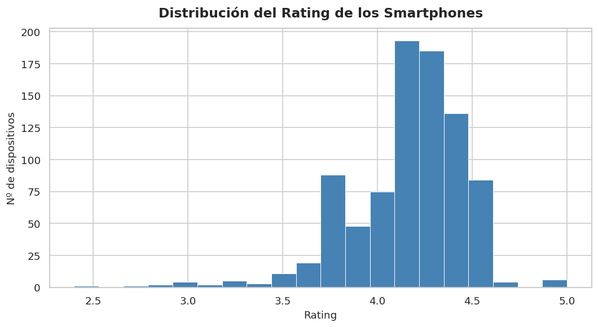
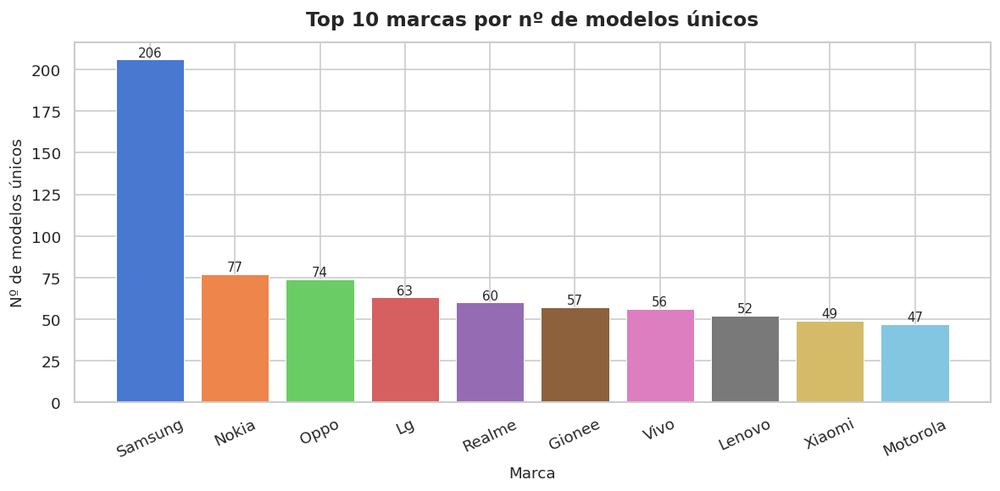
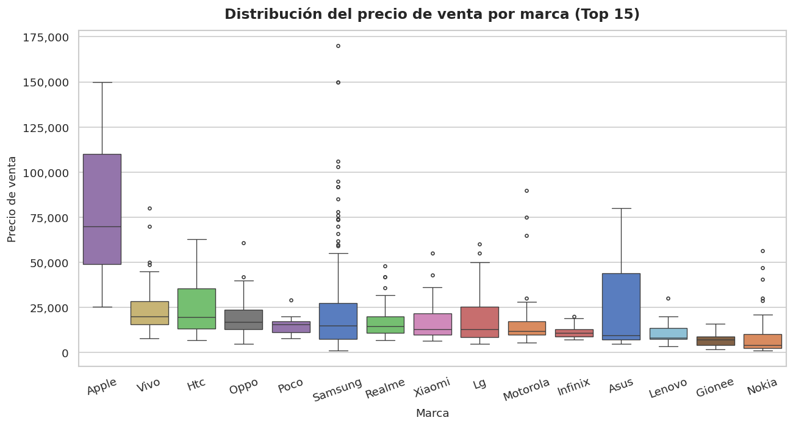
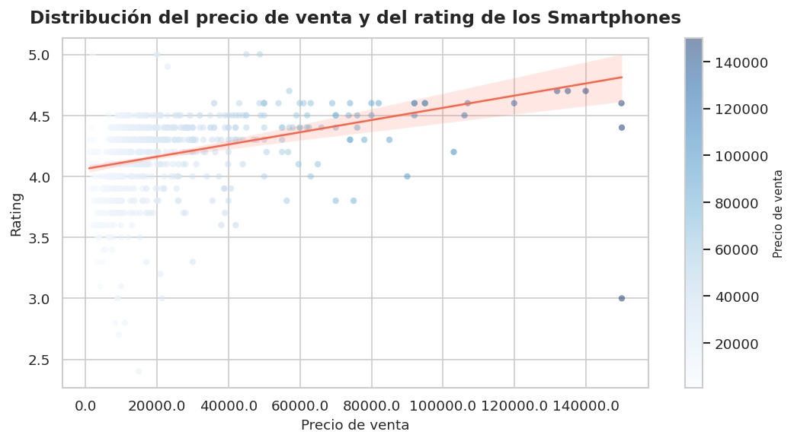
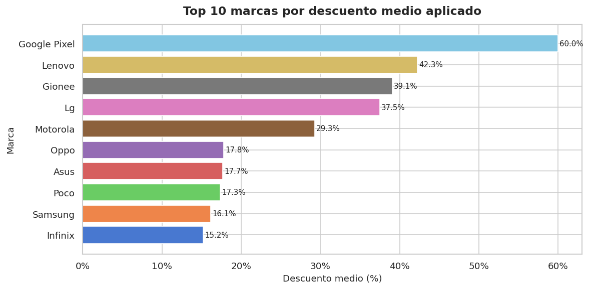
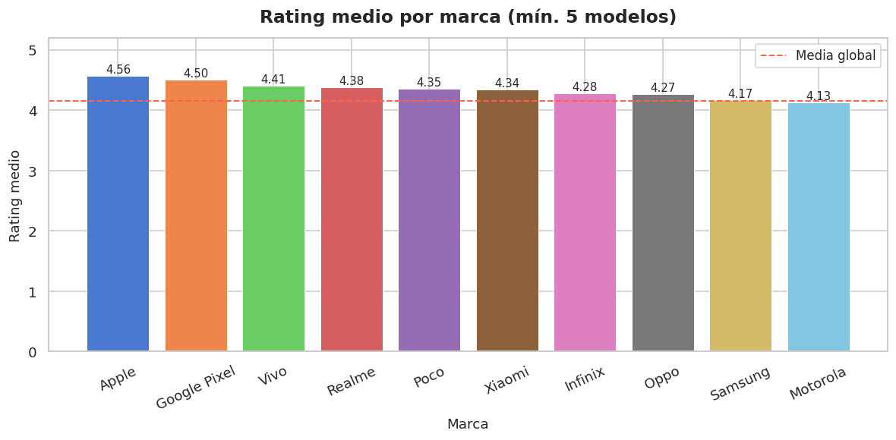

## PROYECTO MODULAR PYTHON

### 1) Objetivo

- Analizar un dataset con información de **Smartphones** más viejos y más actuales para entender mejor el mercado y además entender bien como funciona la limpieza de datos, construcción de características y generación de visualizaciones.

### 2) Dataset

- Fuente: [Smartphone Sale Dataset in Kaggle](https://www.kaggle.com/datasets/yaminh/smartphone-sale-dataset)
- Nº filas/columnas: 3114 Filas y 12 Columnas
- Variables clave: Las columnas más importantes a nivel categórico son, **Brands** y **Models**

### 3) Preguntas

- Q1: ¿Cómo se distribuyen los datos después de la limpieza?
- Q2: ¿Qué características nuevas se pueden derivar?
- Q3: ¿Qué insights se obtienen de las visualizaciones?
- Q4: ¿Que marca acumula más variedad de modelos únicos?
- Q5: ¿Cómo se distribuyen los precios de venta entre las distintas marcas?
- Q6: ¿Existe relación visible entre el precio de venta y el rating de los usuarios?

### 4) Data issues & fixes

- Valores nulos y duplicados → Eliminación o tratamiento de estos en src/cleaner.py.
- Camera en Yes o No → Transoformación a True o False.
- Precios inconsistentes → Tratamiento y Recálculo de precios y descuentos para que se queden en la franja que les toca.
- Formatos innecesarios → Conversión de tipos de datos y transformación de a MB de muchos campos.

### 5) Pipeline

- raw → clean → utils(validate) → export → (feature opcional) recommend

### 6) Hallazgos

- Variedad de Modelos: Lo que se puede apreciar en el **Gráfico 2** es que **Samsung** lidera el mercado en variedad de modelos para poder acceder a clientes con todo tipo de bolsillo mientras que marcas como **Apple** prefieren lanzar menos modelos de forma más selectiva.
- Precio por marca: En el **Gráfico 3** se ve claramente que **Apple** tiene una mediana de precio y distribución mucho más alta que el resto, seguido de Samsung con una gran distribución, pero el resto mantienen un perfil de gama **Media-Baja** para adecuarse a la mayoría de los bolsillos.
- Descuento por marca: En este caso referente al **Gráfico 5**, es interesante ver que no siempre las marcas más conocidas tienen los descuentos más altos, esto puede ser con fines de liquidación de stock, competitividad o simplemente que el precio original estaba sobrevalorado al inicio de la venta del producto.
- Mejor rating por marca: Finalmente en el **Gráfico 6** se puede apreciar que el `Rating Medio` por marca con un mínimo de 5 modelos en la operación mantienen una diferencia pequeña pero consistente, ya que, las marcas dedicadas a la gama **Media-Alta** se mantienen por encima de la media global, mientras que las que son **Media-Baja** o la rozan o están por debajo.

### 7) Contenido del proyecto

- `src/` contiene funciones reutilizables (`cleaner`, `export_csv`, `load_csv`, `recommender`, `utils(validation)`)
- `main.py` ejecuta el pipeline end-to-end
- `notebooks/graphics.ipynb` contiene los gráficos y las conclusiones de estos

### 8) Cómo ejecutar

- `pip install -r requirements.txt`
- Ejecutar pipeline: `python main.py`
- Abrir y ejecutar con el dataset limpio: `notebooks/graphics.ipynb` (Para ver graficos y conclusiones)
- (Opcional) Abrir y ejecutar: `notebooks/eda.ipynb`

### 9) Visualizaciones y Conclusiones de estas

## Gráfico 1 — Distribución del Rating (Q3)



> La distribución del rating está claramente sesgada hacia valores altos, concentrándose la mayoría de dispositivos entre **4.0 y 4.5**. Esto indica que los smartphones bien valorados son lo más usual en el dataset, y los móbiles con valoración inferior a 3.5 son casos más raros.

---

## Gráfico 2 — Modelos únicos por marca (Q4)



> **SAMSUNG** lidera con diferencia en variedad de catálogo, seguida de **Nokia** y **Oppo**. Esto refleja la estrategia de estas marcas de cubrir todos los segmentos de precio con múltiples modelos, frente a marcas como Apple que apuestan por un catálogo más reducido y selectivo.

---

## Gráfico 3 — Distribución de precios por marca (Q5)



> **Apple** presenta la mediana de precio más alta y la dispersión más elevada, lo que refleja que efectivamente se posiciona en gama alta. Marcas como **realme** o **Xiaomi** muestran precios más bajos y concentrados, lo que va acorde a su estrategia de gama media-baja. **SAMSUNG** destaca por tener la mayor dispersión después de Apple, cubriendo desde gama baja hasta alta.

---

## Gráfico 4 — Precio de venta vs Rating (Q6)



> La línea de tendencia muestra una **correlación positiva débil** entre el precio y el rating: los dispositivos más caros tienden a tener valoraciones ligeramente superiores, pero eso no es determinante. Hay dispositivos de precio bajo con ratings altos, lo que sugiere que el precio no es el único factor que determina la satisfacción del usuario.

---

## Gráfico 5 — Descuento medio por marca



> Aquí queda claro que las marcas con mayores descuentos de media no siempre son las más conocidas, lo que puede indicar estrategias de liquidación de stock o mayor presión competitiva en ciertos segmentos. Un descuento elevado sostenido puede ser señal de que el precio original era más elevado de lo que debería respecto al mercado.

---

## Gráfico 6 — Rating medio por marca



> Filtrando marcas con al menos 5 modelos para que la media sea representativa, se observa que las diferencias entre marcas son pequeñas pero consistentes. Las marcas por encima de la media global tienen en común un catálogo orientado a gama media-alta, mientras que las que quedan por debajo tienden a competir principalmente en precio.

---

### 10) Conclusiones

## Conclusiónes Relacionadas con las Preguntas

En respuesta a **Q1** se podría apreciar que tras la limpieza de los datos el dataset queda sin duplicados, los nulos sustituidos por **Unknown** o **0**, los valores que contenían un **MB/GB** ahora son valores `float` convertidos a la misma medida, en este caso **MB**, `Camera` que antes tenía **Yes** o **No**, ahora es un `booleano` que devuelve **True** o **False** y los precios y descuentos ahora mantienen coherencia entre sí.

Tras haber realizado la limpieza de los datos he detectado varias características que se podrían derivar nuevas (**Q2**):

- **Segmento de Precio**: A partir de `Selling Price` se podrías sacar **Gama Alta/Media/Baja**.
- **Relación Calidad/Precio**: Combinando `Rating` y `Selling Price` se podría sacar esta relación.
- **Convertir Descuento**: Se podría convertir `Discount` para que en vez de ser `numeric` fuera `booleano` a partir de `Discount > 0`.
- **Ratio Memoria/Almacenamiento**: Esto se conseguiría combinando ambas tablas `Memory` y `Storage`.

## Conclusión General

Este proyecto demuestra que antes de extraer cualquier conclusión útil de un dataset, la calidad del dato es lo primero. Un dataset de 3114 smartphones con valores nulos, formatos inconsistentes y duplicados no cuenta nada por sí solo; solo después de pasar por el pipeline de limpieza, validación y transformación los datos se vuelven fiables y analizables.

El resultado es un conjunto de datos estructurado desde el que se puede responder preguntas reales sobre el mercado de smartphones: qué marcas dominan, en qué rangos de precio se concentra la oferta o qué relación existe entre almacenamiento, rating y precio final. El módulo de recomendación es una consecuencia directa de esa limpieza: sin datos coherentes en columnas como `Storage`, `Rating` o `Selling Price`, filtrar por criterios del usuario no tendría ningún sentido.

En definitiva, el valor del proyecto no está solo en las visualizaciones o en el recomendador, sino en haber construido un pipeline reproducible y modular que convierte datos crudos en información accionable.

### 11) Estructura final del proyecto

Estructura:

```
mod_proy_py/
├── data/
│   ├── raw/
│   └── processed/
├── images/
├── notebooks/
│   └── eda.ipynb
│   └── graphics.ipynb
├── src/
│   ├── cleaner.py
│   ├── export_csv.py
│   ├── load_csv.py
│   ├── recommender.py
│   └── utils.py
├── .gitignore
├── main.py
├── README.md
└── requirements.txt

```
